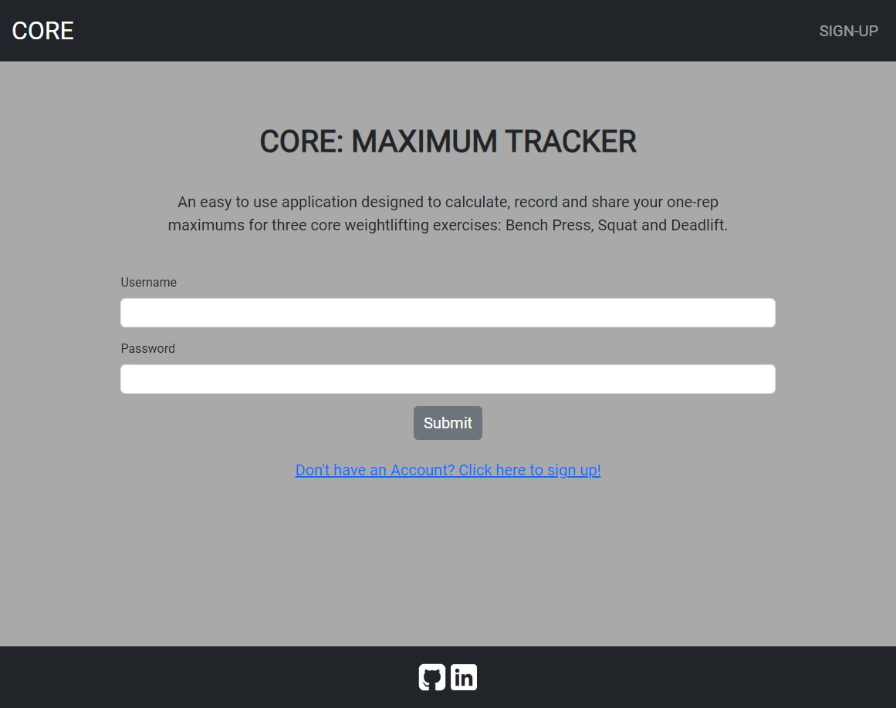
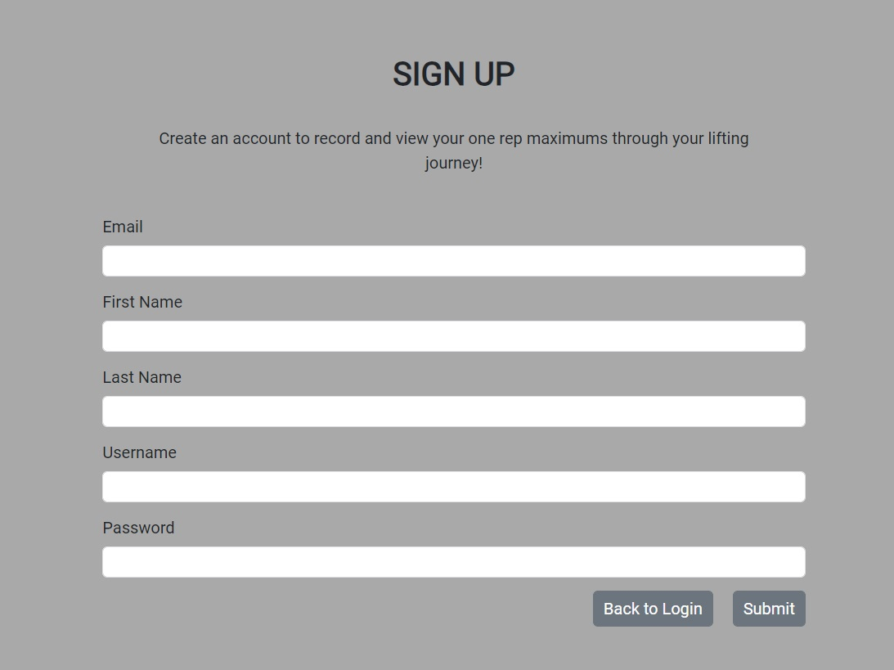
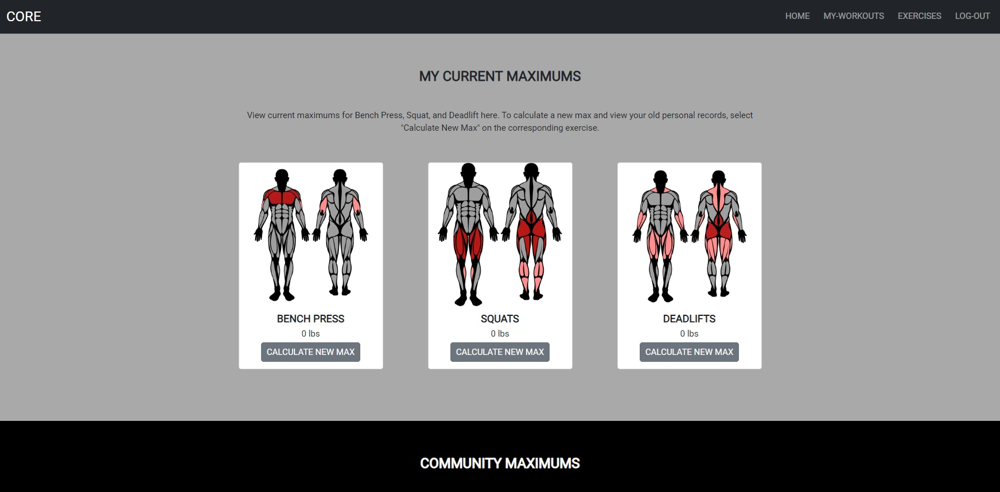
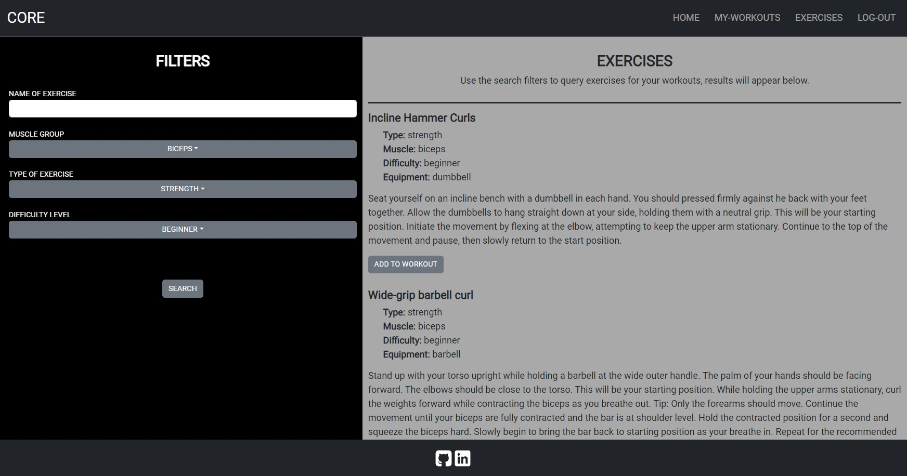
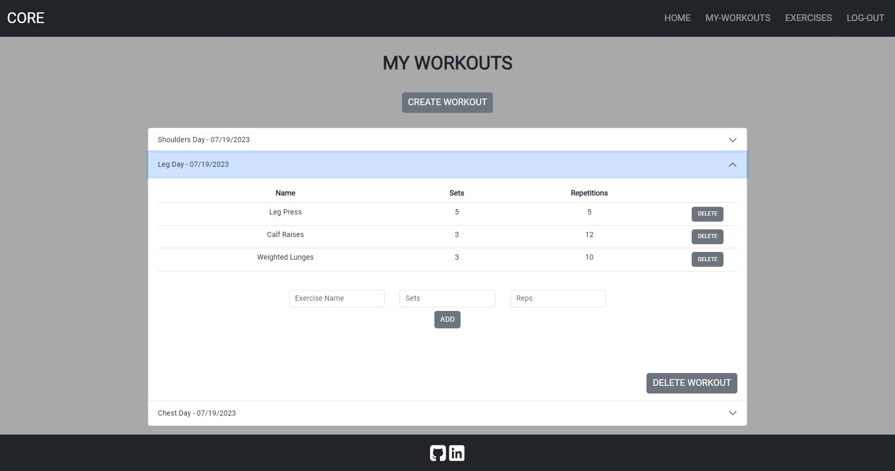
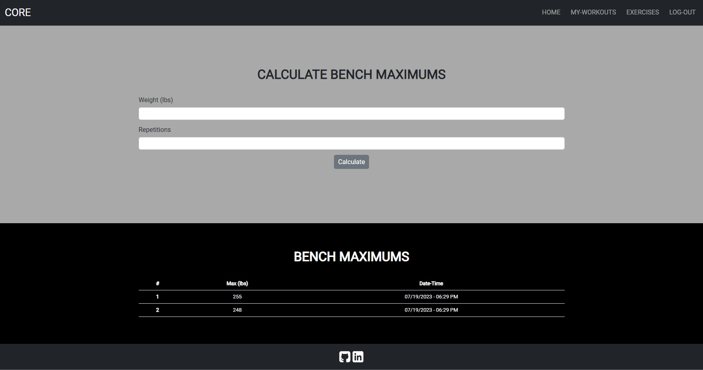

# Core: Workout Tracker

## Table of Contents
1. [Description](#description)
2. [Technologies](#technologies)
3. [Installation](#installation)
4. [Usage](#usage)
5. [Contributing](#contributing)
6. [Tests](#tests)
7. [License](#license)
8. [Questions](#questions)
9. [Media](#media)

## Description
This was originally a collaborative project done between myself and my classmates. The original repository can be found [HERE](https://github.com/Raflores10/workout-tracker). I sought to build this project on my own as a way to challenge myself and continually learn. 

This fullstack application allows you to create an account and keep track of your progress in the Gym. At this time, Core focuses on three core exercises, Bench Press, Squat, and Deadlift. With your account you can record your progress and see how far you've come in your weightlifting journey as well as research, create and save workouts / exercises.

## Technologies
- HTML
- CSS
- JavaScript
- Bootstrap
- Node.js
- Express.js
- Express-Session
- Handlebars.js
- bcrypt.js
- MySql2
- Sequelize
- API Ninjas' Exercise API

## Installation
You can access the deployed site [HERE].(https://core-wt-3bc894879624.herokuapp.com/). 

1. Navigate to the folder where you would like to clone the repository.
2. Clone the repository into your folder.
3. In the terminal, run `npm i` from the root folder of the repository.
4. In the terminal, run `node index.js`.

## Usage
Record your one rep maximums for three core execises, Bench, Squat and Deadlift. Research, create, and save workouts and exercises to help you reach lifting goals.

## Contributing
This application is open source and can be accessed and used by anyone. If you would like to make contributions to my repository, feel free to reach out to me at the email provided below and I'll respond as soon as able.

## Tests
No test suites have been run on this application at this time. All tests were done manually by myself to ensure functionality.

## License
This application is currently covered under the MIT License. More information about this license can be viewed under the file named 'LICENSE' in the repository.

## Questions
If you have any questions, feel free to reach out to me at my email: djohncaldwell@gmail.com

All of my work can be viewed at my GitHub profile: [CaldwellDerek](https://github.com/CaldwellDerek)

## Media

1. Login Page

2. Signup Page

3. Home Page

4. Exercises Page

4. Workout Page

4. Bench Max Page
